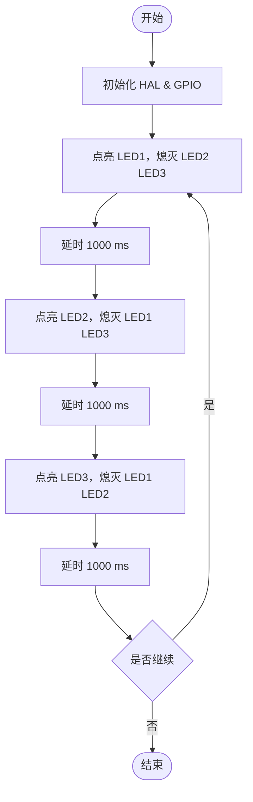

# 嵌入式系统原理与应用实验报告

专业班级：计2307班                                 
组员：许洋帆（235150732）姚志昊（235150734）

实验日期：2025年10月21日

## 实验二：外部中断实验---开关优化


#### 一、实验目的

1. 掌握STM32的中断控制器和外部中断的工作原理
2. 学会使用相关工具配置中断以及使用HAL库处理中断的编程方法
3. 掌握使用HAL库读取输出引脚的状态


#### 二、实验内容

		1.	STM32CubeMX中配置外部中断
		2.	HAL库工程解析
		3. 	实验要求体现
		        ( 1 )在按键中断回调函数中加入读取红灯的状态的语句，翻转红灯的状态，即原来是灯的变灭，灭的变亮(注:不能使用HAL GPIO TogglePin函数）
			( 2 )另建一个工程，修改代码，不使用中断的方式，直接读取按键引脚状态，然后改变绿灯的状态。对比本实验中三种改变灯状态的实现方式。


#### 三、实验过程

1. 电路图及说明
   


　　说明：板子上的绿灯、蓝灯和红灯分别连接到的芯片上的PB0、PB14、PB7引脚，均为高电平点亮
　　2. 基本原理
　　通过代码使得开发版上PB0、PB14、PB7引脚的电平通过一定频率变化，使得蓝绿红三种灯可以轮流闪烁


#### 四、编程

1. 程序流程图




2. 主要代码段及解释

  
 初始化代码解释在注释里
 
   ```c
 static void MX_GPIO_Init(void)
{
  GPIO_InitTypeDef GPIO_InitStruct = {0};
/* USER CODE BEGIN MX_GPIO_Init_1 */
/* USER CODE END MX_GPIO_Init_1 */

  /* GPIO Ports Clock Enable */
 /* 使能GPIO端口时钟，开启对应时钟 */
  __HAL_RCC_GPIOC_CLK_ENABLE();
  __HAL_RCC_GPIOB_CLK_ENABLE();
  __HAL_RCC_GPIOA_CLK_ENABLE();

  /*Configure GPIO pin Output Level */
  /* 初始化LED引脚电平，设为低电平 */
  HAL_GPIO_WritePin(GPIOB, LD1_Pin|LD3_Pin|LD2_Pin, GPIO_PIN_RESET);

  /*Configure GPIO pin : Button_Pin */
/* 配置按键引脚：上升沿触发的外部中断模式 */
  GPIO_InitStruct.Pin = Button_Pin;
/* 中断模式，上升沿触发（按键按下） */
  GPIO_InitStruct.Mode = GPIO_MODE_IT_RISING;
  GPIO_InitStruct.Pull = GPIO_NOPULL;
  HAL_GPIO_Init(Button_GPIO_Port, &GPIO_InitStruct);

  /*Configure GPIO pins : LD1_Pin LD3_Pin LD2_Pin */
 /* 配置LED引脚：推挽输出模式 */
  GPIO_InitStruct.Pin = LD1_Pin|LD3_Pin|LD2_Pin;  
  GPIO_InitStruct.Mode = GPIO_MODE_OUTPUT_PP;
  GPIO_InitStruct.Pull = GPIO_NOPULL;
/* 低速模式/
  GPIO_InitStruct.Speed = GPIO_SPEED_FREQ_LOW;
  HAL_GPIO_Init(GPIOB, &GPIO_InitStruct);

  /* EXTI interrupt init*/
主优先级3，子优先级0（引脚10-15共享此中断） */
  HAL_NVIC_SetPriority(EXTI15_10_IRQn, 3, 0);
/* 使能外部中断线10-15 */
  HAL_NVIC_EnableIRQ(EXTI15_10_IRQn);

/* USER CODE BEGIN MX_GPIO_Init_2 */
/* USER CODE END MX_GPIO_Init_2 */
}
   ```

   功能实现部分代码解释在注释当中：

 ( 1 )在按键中断回调函数中加入读取红灯的状态的语句，翻转红灯的状态，即原来是灯的变灭，灭的变亮(注:不能使用HAL GPIO TogglePin函数）

   ```c

void HAL_GPIO_EXTI_Callback(uint16_t GPIO_Pin)

{
    
{ 
    /*定义一个变量存储读取的引脚电平值*/
    uint8_t ledState = HAL_GPIO_ReadPin(GPIOB, LD3_Pin);
   /*判断是否为高电平*/
    if (ledState == GPIO_PIN_SET)
	/*是亮的就关了*/
        HAL_GPIO_WritePin(GPIOB, LD3_Pin, GPIO_PIN_RESET);
	/*如果是灭的就让他亮起来*/
    else
        HAL_GPIO_WritePin(GPIOB, LD3_Pin, GPIO_PIN_SET);
}
/* USER CODE END HAL_GPIO_EXTI_Callback 0 */
						}
/* USER CODE END 4 *//* USER CODE BEGIN 4 */

   ```

功能实现部分代码解释在注释当中：
( 2 )另建一个工程，修改代码，不使用中断的方式，直接读取按键引脚状态，然后改变绿灯的状态。对比本实验中三种改变灯状态的实现方式。


   ```c
/* USER CODE BEGIN 4 */
void HAL_GPIO_EXTI_Callback(uint16_t GPIO_Pin)

{
    
	
	
	
			/*检查按键状态*/
			
			if (HAL_GPIO_ReadPin(Button_GPIO_Port, Button_Pin) == GPIO_PIN_SET)
			
			{
				uint8_t ledState = HAL_GPIO_ReadPin(GPIOB, LD1_Pin);/*读取当前状态*/

				/*状态翻转*/
				if (ledState == GPIO_PIN_SET)
					{
                   			 HAL_GPIO_WritePin(GPIOB, LD1_Pin, GPIO_PIN_RESET); 
                }
               			 else
                {
                   			 HAL_GPIO_WritePin(GPIOB, LD1_Pin, GPIO_PIN_SET); 
                }
							}
					
	
   
    /* USER CODE END HAL_GPIO_EXTI_Callback 0 */
						}
/* USER CODE END 4 */


   ```


#### 五、实验小结

成功配置 GPIOB 口 LD0/LD1/LD2 三个引脚为推挽输出模式。
在 while(1) 用户代码区实现**“轮流亮灭”**逻辑：
LD0 → 灭 → LD1 → 灭 → LD2 → 灭 → 循环；每个状态持续 1000 ms，现象清晰。
使用 HAL_GPIO_WritePin 单灯控制，一条语句对应一个灯，便于后续扩展与调试。


